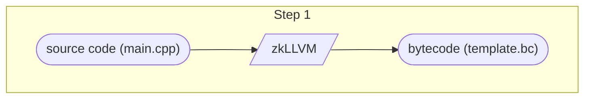
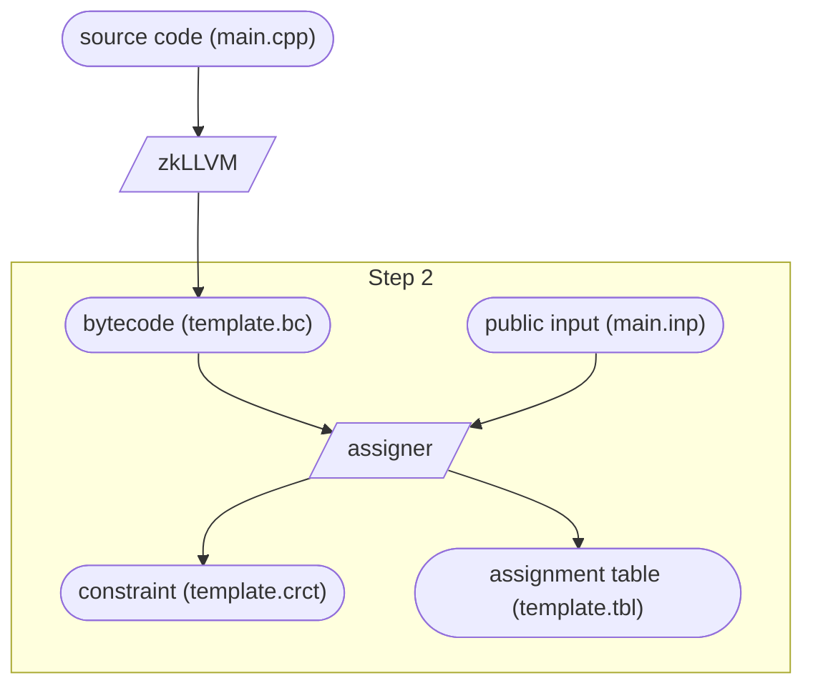
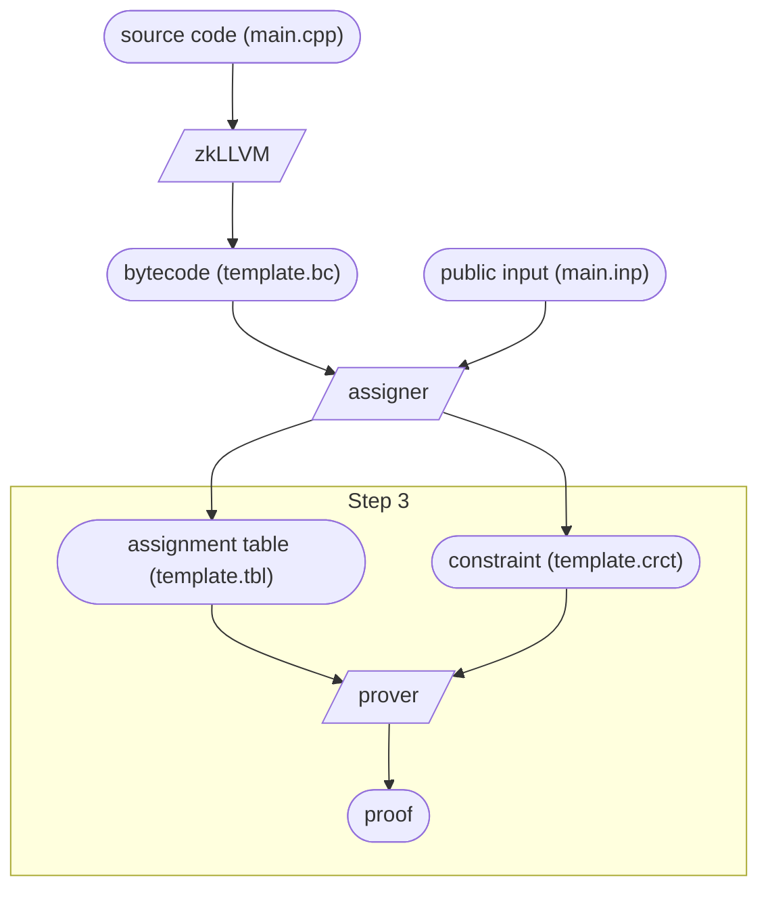
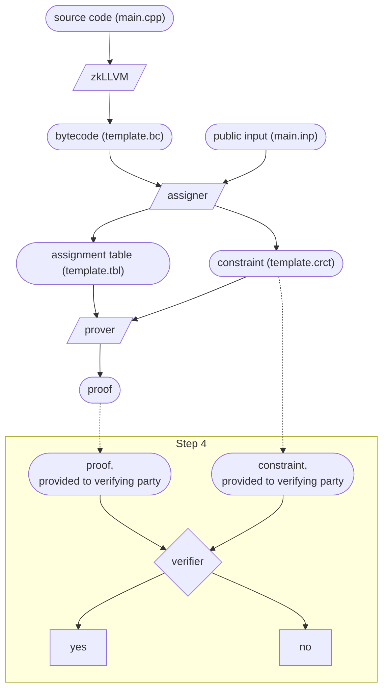
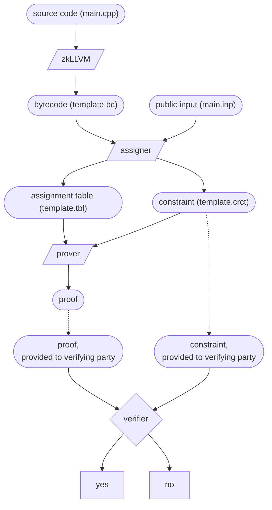

# zkLLVM Template

Tutorial and a template repository for a zk-enabled application project
based on the [zkLLVM toolchain](https://github.com/nilfoundation/zkllvm).
Use it to learn about developing zk-enabled apps with zkLLVM step-by-step.

For this tutorial you will need an amd64 machine with Docker (on Linux) or Docker Desktop (on macOS).

Code in `./src` is an example of BLS12-381 signature verification via zkLLVM using
[Crypto3 C++ cryptography suite](https://github.com/nilfoundation/crypto3) as an SDK.

# Preparing environment with zkLLVM

## 1. Clone the template repository and submodules

First, clone this repository with all its submodules:

```bash
git clone --recurse-submodules git@github.com:NilFoundation/zkllvm-template.git
cd zkllvm-template
```

If you cloned without `--recurse-submodules`, make sure you initialize submodules:

```bash
git submodule update --init --recursive
```

## 2. Build a Docker image with zkLLVM environment

Build a Docker image with zkLLVM and other project dependencies:

```bash
docker build . -t zkllvm-template:latest
```

We're using Docker to avoid installing packages on the host machine,
and because it allows us to have the same environment on any system.

## 3. Run a Docker container from this image

Now, run a new Docker container
and mount this project's directory in it:

```bash
docker run -it --rm \
  --platform=linux/amd64 \
  -v $(pwd):/opt/zkllvm-template \
  zkllvm-template:latest

cd /opt/zkllvm-template
```

Let's check that we have the zkLLVM compiler available.
Note that it replaces original clang, being a fully compatible drop-in replacement:

```
clang --version
# clang version 16.0.0 (https://github.com/NilFoundation/zkllvm-circifier.git bf352a2e14522504a0c832f2b66f73268c95e621)
# Target: x86_64-unknown-linux-gnu
# Thread model: posix
# InstalledDir: /usr/bin
```

# Local development workflow

In the first part of this tutorial, we'll walk through the development workflow on
a local machine, without using Proof Market.
We will build a circuit, generate a proof, and then verify this proof.

## Step 0: Setup build environment

First, make a clean build directory and initialize cmake:

``` 
mkdir build && cd build
cmake ..
```

## Step 1: Build a byte-code representation of the circuit

Time to compile our code from `./src/main.cpp` with zkllvm!
In our code, we have a `[[circuit]]` section, which is the circuit itself.
We will use zkLLVM compiler to make a byte-code representation of this circuit.

```
make template
```

As a result of this command, we will get a byte-code file 
`./build/src/template.bc`.
It's using the LLVM's intermediate representation format and
for now it will serve as a circuit base.



## Step 2: Build the proof for specific input & output


Next, we will use the `assigner`, which is a part of the zkLLVM toolchain,
to generate the proof

```
assigner \
  # use compiled bytecode
  -b src/template.bc \
  # take input from main.inp
  -i ../src/main.inp \
  # write constraint file to template.crct
  -c template.crct \
  # write assignment table to template.tbl
  -t template.tbl \
  # use pallas arithmetization algorithm  
  -e pallas
```

As a result, we will have two new files:

* `template.crct` is constraint file.
  It is something like a mathematical model of our code's calculations, regardless of the input.
  We will use it to calculate the proof and, later, to verify it.
  
* `template.tbl` is an assignment table.
  It is based on the exact input values and contains their representation in the model above.
  If you know what a *witness* is, assignment table plays the same role.




## Step 3: generate a proof





## Step 4: Verify a proof




## Overview





# Working with proof market

# Step 2: Setup proof market user/toolchain
Please navigate out of the `zkllvm-tfemplate` repository

Clone the proof-market-toolchain repository

```
git clone --recurse-submodules git@github.com:NilFoundation/proof-market-toolchain.git
cd proof-market-toolchain
```

- Create a new user
All access to market requires authentication. Please ensure you have a valid username/password. If you have not registered , please look at instructions on how to here via front end .
Or , you can use the below command line in the proof-market-toolchain repository.

```
python3 signup.py -u <username> -p <password> -e <e-mail>
```

Create a .user and a .secret file and add your username and password to it,
You should do this inside the scripts directory in the proof market tool-chain repository.
.user file should consist of your username (without newline)

```
username
```
.secret file should consist of your password(without newline)
```
password
```

# Step 3 :Prepare circuit to publish to Proof Market
```
python3 scripts/prepare_statement.py -c=/root/tmp/zkllvm/build/examples/arithmetics_example.ll -o=arithmetic.json -n=arithmetic -t=placeholder-zkllvm
```

# Step 4: See All Published circuits
```
python3 scripts/statement_tools.py get
```

# Step 5: Push a Bid
```
python3 scripts/bid_tools.py push --cost <cost of the bid> --file <json file with public_input> --key <key of the statement> 
```

# Step 6: Push an Ask
```
python3 scripts/ask_tools.py push --cost <cost of the ask> --key <key of the statement> 
```

# Step 7 : Fetch statements/inputs for proof generation
```
python3 scripts/statement_tools.py get --key <key of the statement> -o <output file>
python3 scripts/public_input_get.py --key <bid key> -o <output file path> 
```

# Step 8 : Generate Proof
- Build proof generator
```
mkdir build && cd build
cmake -G "Unix Makefiles" -DCMAKE_BUILD_TYPE=Release -DCMAKE_C_COMPILER=/usr/bin/clang-12 -DCMAKE_CXX_COMPILER=/usr/bin/clang++-12 ..
# Single-threaded version
cmake --build . -t proof-generator
```
- Generate Proof!
```
./bin/proof-generator/proof-generator --proof_out=/root/workshop/arith_proof.out --circuit_input=/root/tmp/proof-market-toolchain/arithmetic.json --public_input=/root/tmp/proof-market-toolchain/example/input/arithmetic_example/input.json
```

# Step 9: Publish Proof
```
python3 scripts/proof_tools.py push --bid_key <key of the bid> --ask_key <key of the ask> --file <file with the proof> 
```


# Common issues

## Compilation Errors
If you have more than one compiler installed i.e g++ & clang++. The make system might pick up the former. You can explicitly force usage of 
clang++ by finding the path and passing it in the variable below.

```
`which clang++`  
cmake .. -DCMAKE_CXX_COMPILER=<path to clang++ from above>
```

## Submodule management
Git maintains a few places where submodule details are cached. Sometimes updates do not come through. ex: Deletion , updating
a url of a previously checked out submodule.It is advisable to check these locations for remains or try a new checkout.
- .gitmodules
- .git/config
- .git/modules/*
